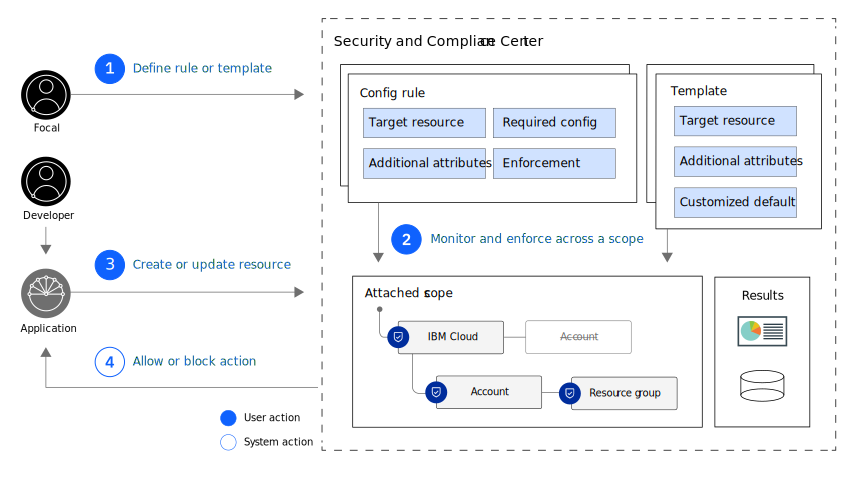
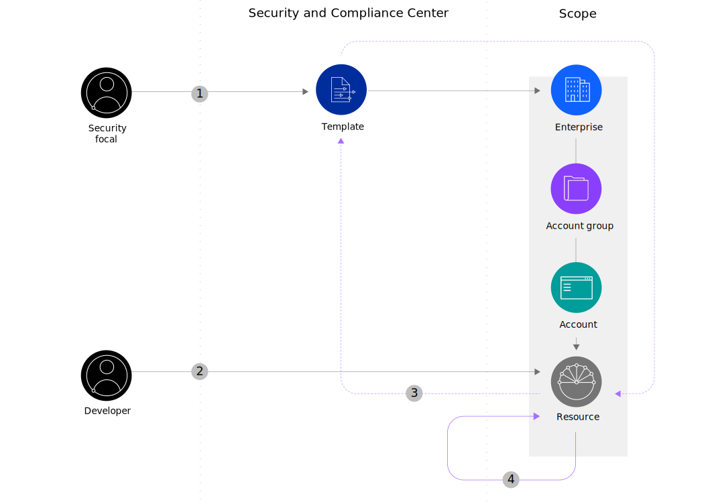
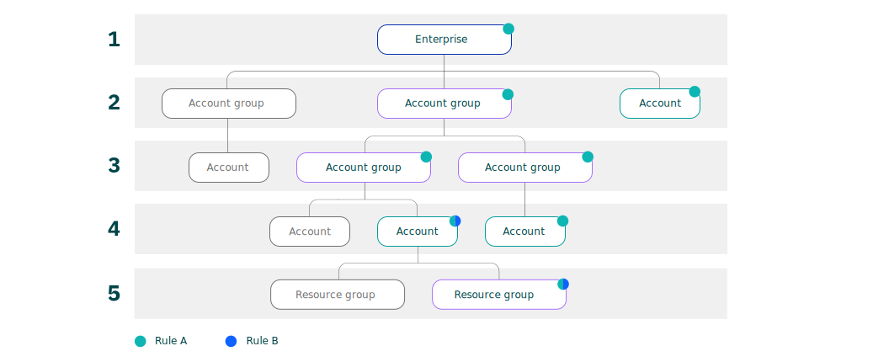

---

copyright:
  years: 2020, 2022
lastupdated: "2022-10-04"

keywords: rule, config rule, what is a config rule, resource configuration, resource governance, governance, properties, conditions, templates, properties, govern

subcollection: security-compliance

---

{:codeblock: .codeblock}
{:screen: .screen}
{:download: .download}
{:external: target="_blank" .external}
{:faq: data-hd-content-type='faq'}
{:gif: data-image-type='gif'}
{:important: .important}
{:note: .note}
{:pre: .pre}
{:tip: .tip}
{:preview: .preview}
{:deprecated: .deprecated}
{:beta: .beta}
{:term: .term}
{:shortdesc: .shortdesc}
{:script: data-hd-video='script'}
{:support: data-reuse='support'}
{:table: .aria-labeledby="caption"}
{:troubleshoot: data-hd-content-type='troubleshoot'}
{:help: data-hd-content-type='help'}
{:tsCauses: .tsCauses}
{:tsResolve: .tsResolve}
{:tsSymptoms: .tsSymptoms}
{:java: .ph data-hd-programlang='java'}
{:javascript: .ph data-hd-programlang='javascript'}
{:swift: .ph data-hd-programlang='swift'}
{:curl: .ph data-hd-programlang='curl'}
{:video: .video}
{:step: data-tutorial-type='step'}
{:tutorial: data-hd-content-type='tutorial'}
{:ui: .ph data-hd-interface='ui'}
{:cli: .ph data-hd-interface='cli'}
{:api: .ph data-hd-interface='api'}
{:release-note: data-hd-content-type='release-note'}

# What is Configuration Governance?
{: #what-is-governance}

By using the {{site.data.keyword.compliance_full}}, you can significantly decrease the likelihood of a misconfiguration-related security issue by setting guardrails around the way that your resources can be configured.
{: shortdesc}

## Understanding how Configuration Governance works
{: #gov-works}

With the Configuration Governance component of the {{site.data.keyword.compliance_short}}, you are able to define rules and templates that can help to standardize your organizations resource configuration. When you create a rule and enable enforcement, you can apply it to your entire enterprise, account, or a subset of your resources by limiting your scope to a resource group. Then, when a rule is in place, a user in your account is unable to provision a resource or set a configuration that violates the rule. In some situations, resource configurations require multiple API calls to set. In these cases, you must also define a template in order for the resource to be configured. Check out the following diagram to see the validation flow in action.

{: caption="Figure 1. How the Configuration Governance components work together" caption-side="bottom"}

Want to see rules in action? Check out [Preventing public network access on {{site.data.keyword.keymanagementserviceshort}} with the {{site.data.keyword.compliance_short}}](https://www.ibm.com/cloud/blog/prevent-public-network-access-on-key-protect-instances-with-the-security-and-compliance-center){: external}!
{: note}

## Best practices for preventing the misconfiguration of resources
{: #best-practices-gov}

With {{site.data.keyword.compliance_short}}, you can govern the resources in your {{site.data.keyword.cloud_notm}} accounts. But, what does that really mean? Check out the following use cases to see how you might take advantage of resource governance.

| Scenario | Solution | 
|:---------|:---------|
| You want to display configuration settings that are specific to your enterprise as your teams are configuring and provisioning resources. | You can create configuration templates in the {{site.data.keyword.compliance_short}} that override the default values that are provided by {{site.data.keyword.cloud_notm}} with the values that are applicable to your organization. |
| You want to know when a user creates resources that are outside the standards that are defined for your organization, but you don't want to stop them. | You create a configuration rule but choose not to enforce it. This can be helpful for accounts that you use for testing. |
| You want to ensure that a specific configuration for a resource type is always enforced in your account. | You can define an enforced configuration rule. When a rule is enforced, {{site.data.keyword.cloud_notm}} does not allow the resource to be created unless all the conditions of the rule are met. Note: Some configuration rule [properties](/docs/security-compliance?topic=security-compliance-available-rule-properties) require a template to be applied in order for the rule to be enforced. |
{: caption="Table 1. Governance use-cases" caption-side="top"}

### Enforcing configuration standardization with rules
{: #config-rule-understand}

Rules help you to standardize the fine-grained configurations of your {{site.data.keyword.cloud_notm}} services. As an administrator, you can determine where your organization might benefit from guardrails around resource configuration and then use the {{site.data.keyword.compliance_short}} to create and monitor them. By attaching your rule to a specific [scope](/docs/security-compliance?topic=security-compliance-rules-apply), you can limit the rule to a specific section of your business. In addition to real-time rule enforcement, a daily scan is run every 24 hours on all the scopes that have rules attached in order to detect whether any resources are in violation of a defined config rule.

{: caption="Figure 2. Config rule sequence flow" caption-side="bottom"}

1. As a security focal, you create a config rule and attach it to a scope.
2. A developer makes a request to create or modify a resource that is part of the scope that the rule is attached to.
3. The target resource evaluates the request against your defined rule.
4. The target resource blocks or allows the action to complete based on compliance with the attached rule.

### Customizing configuration defaults with templates
{: #customize-default-values}

With templates, you can define your preferred values, or customized defaults, on properties that are used to configure an {{site.data.keyword.cloud_notm}} resource. By creating templates that users in your accounts can regularly review and reference, you set guidelines for teams to follow. After you attach a template to a [scope](#x2037763){: term}, your customized defaults are applied by target services to ensure that your selections override the IBM-defined values each time that a target resource is created.

You can use templates to override IBM-defined property values only. A user can override a template by selecting new values during or after resource configuration. To ensure that each property is defined only once per resource, you can only add a property to one template per scope at a time.
{: note}

Check out the following diagram to see an example template sequence:

{: caption="Figure 3. Template sequence flow" caption-side="bottom"}

1. As an account admin or security focal, you create a configuration template and attach it to a scope.
2. A developer makes a request to create or modify a resource that is part of the scope that the rule is attached to.
3. The target service checks for an existing template in the {{site.data.keyword.compliance_short}}.
4. The target service uses the template data to apply your customized default values on the new resource.

### Applying your rules and templates
{: #hierarchy}

As you create rules or templates and attach them to scopes, your defined configurations move down your account hierarchy. If you attach a rule to your entire enterprise, the rule is applied to the target resources that exist within the enterprise. Likewise, if you limit a template to a specific account group, its properties are inherited by the accounts that exist in that group. You can choose to exclude scopes, such as accounts that are used for testing, so that your rule or template is applied only where you need it.

The following diagram shows how two rules are applied across an enterprise. As you can see, some of the accounts are excluded from the rule's scope.

{: caption="Figure 4. Config rule inheritance" caption-side="bottom"}

## How can I get started?
{: #gov-next-steps}

To get started with rules, you can go to the **Menu icon**  **> Security and Compliance > Configure**, or check out the [API reference](/apidocs/security-compliance-config){: external} to learn more about creating rules and templates programmatically.

To get started, choose whether to create [a rule](/docs/security-compliance?topic=security-compliance-rules-define) or [a template](/docs/security-compliance?topic=security-compliance-templates-define).

