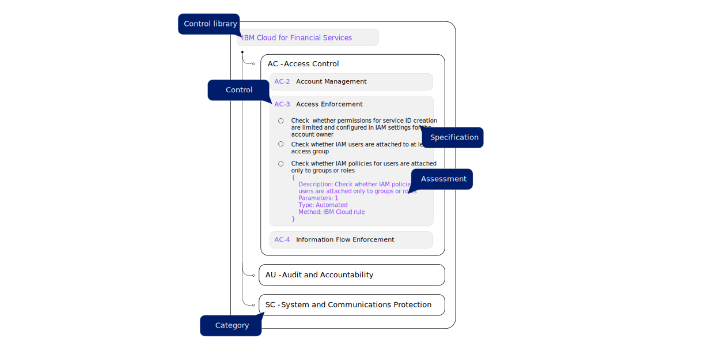

---

copyright:
  years: 2020, 2022
lastupdated: "2022-12-14"

keywords: custom profiles, user-defined, controls, goals, security, compliance

subcollection: security-compliance

---

{:codeblock: .codeblock}
{:screen: .screen}
{:download: .download}
{:external: target="_blank" .external}
{:faq: data-hd-content-type='faq'}
{:gif: data-image-type='gif'}
{:important: .important}
{:note: .note}
{:pre: .pre}
{:tip: .tip}
{:preview: .preview}
{:deprecated: .deprecated}
{:beta: .beta}
{:term: .term}
{:shortdesc: .shortdesc}
{:script: data-hd-video='script'}
{:support: data-reuse='support'}
{:table: .aria-labeledby="caption"}
{:troubleshoot: data-hd-content-type='troubleshoot'}
{:help: data-hd-content-type='help'}
{:tsCauses: .tsCauses}
{:tsResolve: .tsResolve}
{:tsSymptoms: .tsSymptoms}
{:java: .ph data-hd-programlang='java'}
{:javascript: .ph data-hd-programlang='javascript'}
{:swift: .ph data-hd-programlang='swift'}
{:curl: .ph data-hd-programlang='curl'}
{:video: .video}
{:step: data-tutorial-type='step'}
{:tutorial: data-hd-content-type='tutorial'}
{:ui: .ph data-hd-interface='ui'}
{:cli: .ph data-hd-interface='cli'}
{:api: .ph data-hd-interface='api'}
{:release-note: data-hd-content-type='release-note'}

# Creating custom control libraries
{: #custom-library}

With {{site.data.keyword.compliance_full}}, you can create a custom control library that is specific to your organization's needs. You define the controls and specifications before you map previously created assessments.
{: shortdesc}

{: caption="Figure 1. Understanding control libraries" caption-side="bottom"}

A control library is a grouping of controls that are added to {{site.data.keyword.compliance_short}}. The service offers several predefined libraries that are designed to help meet compliance for a specific use case. Each control has several specifications and assessments that are mapped to it. A specification is a defined requirement that is specific to a component. When met by an organization, the specification helps to ensure that they are compliant with the control. An assessment, or several, are mapped to each specification with a detailed evaluation that is done to check whether the specification is compliant. For more information, see [Key Concepts](/docs/security-compliance?topic=security-compliance-posture-management).

## Before you begin
{: #before-custom-library}

Before you get started, be sure that you have the required level of access to create and manage libraries. To manage libraries, you need the [**Editor** platform role or higher](/docs/security-compliance?topic=security-compliance-access-management).

## Creating a library
{: #create-custom-library-ui}

You can create a custom library by using the {{site.data.keyword.compliance_short}} UI.

1. In the {{site.data.keyword.cloud_notm}} console, click the **Menu** icon  **> Security and Compliance** to access the {{site.data.keyword.compliance_short}}.
2. In the navigation, click **Controls > Control libraries**. 
3. Click **Create**. A side panel opens.
4. Provide a name, description, and version for your library.
5. Click **Create**. Your library opens in a new page but is empty.
6. To start adding controls, click **Create**.
	1. Provide the details for your control by including a **Name**, **Description**, and **Category**.
	2. Click **Add** to start adding existing specifications to your control.
	3. Provide a **Description** for your specification.
	4. Select a **Component**.
	5. Select the existing assessments that can help to evaluate your specification, then click **Create**.

	If you don't see an assessment that is specific to your use case, you can create a rule. When the rule is created, it shows in the assessment section.
	{: tip}

	6. When you are finished adding specifications to your control, click **Create**.
	7. Repeat these steps until you add all your controls.

## Next steps
{: #library-next}

After your library is added to the service, you can use it to create a profile. From your library details, click **Actions > Create profile** to start evaluating your resources.

