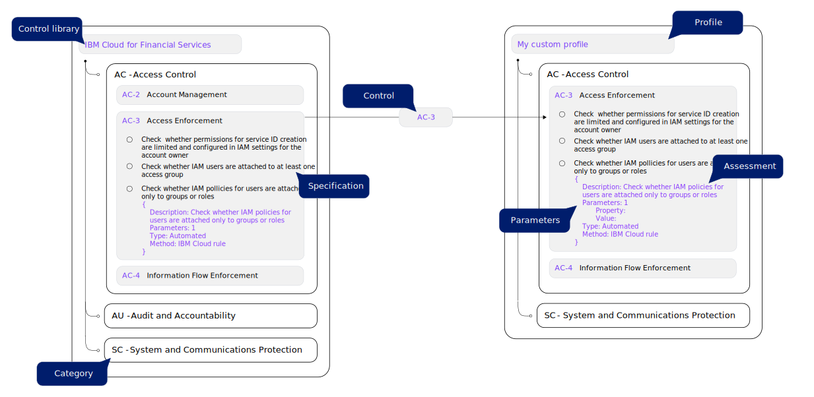

---

copyright:
  years: 2020, 2023
lastupdated: "2023-08-17"

keywords: custom profiles, user-defined, controls, goals, security, compliance

subcollection: security-compliance

---

{{site.data.keyword.attribute-definition-list}}


# Building custom profiles
{: #build-custom-profiles}

With {{site.data.keyword.compliance_full}}, you can take advantage of predefined profiles that are curated based on industry standards, or you can choose to create one specific to your usecase from an existing library.
{: shortdesc}


{: caption="Figure 1. Understanding profiles" caption-side="bottom"}


A profile is a grouping of controls that can be evaluated for compliance. In {{site.data.keyword.compliance_short}}, you can work with predefined profiles, or you can create a profile by selecting controls that have already been added to a control library. Controls already have specifications and assessments that are associated with them, but you can choose to create your own. To learn more about each entity, see [Key Concepts](/docs/security-compliance?topic=security-compliance-posture-management).


## Before you begin
{: #before-profiles}

Before you get started, be sure that you have the required level of access to create and manage profiles. To manage profiles, you need the [**Editor** platform role or higher](/docs/security-compliance?topic=security-compliance-access-management).


## Building a profile
{: #create-profile-ui}
{: ui}

You can create a profile through the console by using a control library as a guide.

1. In the {{site.data.keyword.cloud_notm}} console, click the **Menu** icon  **> Security and Compliance > Profiles**, and click **Create**.
2. Provide your profile details, including a **Name**, **Version**, and optionally a **Description**.

	The version of your profile must be specified in SemVer format. For example, `1.0.2` or `2.1.3-alpha`.

3. Click **Next**.
4. Add controls.
	1. Click **Add**.
	2. Select the control library that you want to work from.
	3. Select the controls that you want to evaluate.

		To see the specifications that are available for each of the controls click the **Eye** icon.
		{: tip}

	4. When you have all your selections, click **Add**.
5. Click **Next**.
6. Define the parameter values.

	Expand each specification to view the parameter inputs.

7. Click **Create**.

## Building a profile with the API
{: #create-profile-api}
{: api}

You can create a profile with the API by using a control library as a guide.

```bash
curl -X POST 
	--location --header "Authorization: Bearer {iam_token}" 
	--header "Accept: application/json" 
	--header "Content-Type: application/json" 
	--data '{ 
				"profile_name": "test_profile1", 
				"profile_description": "test_description1", 
				"profile_type": "custom", 
				"profile_version": "1.0.0", 
				"version_group_label": "58a5922f-0763-485b-91ef-92cca4125d9d", 
				"controls": [ 
					{ 
						"control_library_id": "e98a56ff-dc24-41d4-9875-1e188e2da6cd", 
						"control_id": "1fa45e17-9322-4e6c-bbd6-1c51db08e790" 
						} 
					], 
				"default_parameters": [ 
					{ 
						"assessment_type": "Automated", 
						"assessment_id": "rule-a637949b-7e51-46c4-afd4-b96619001bf1", 
						"parameter_name": "session_invalidation_in_seconds", 
						"parameter_default_value": "120", 
						"parameter_display_name": "Sign out due to inactivity in seconds", 
						"parameter_type": "numeric" 
					} 
				] 
			}'
		"https://us-south.compliance.cloud.ibm.com/instances/{instance_id}/v3/profiles"
```
{: pre}
{: curl}

sdk-java>

```java


```
{: codeblock}
{: java}

</sdk-java>

A successful response returns a boolean that confirms that `success` is `true`. For more information about the required and optional request parameters, check out the [API docs](/apidocs/security-compliance#create-profile).


## Next steps
{: #profile-next}

Now that you have a profile, start evaluating your resources by creating an attachment. From the profile details page, click the overflow menu for the profile that you want to evaluate. Then, click **Attach**.

