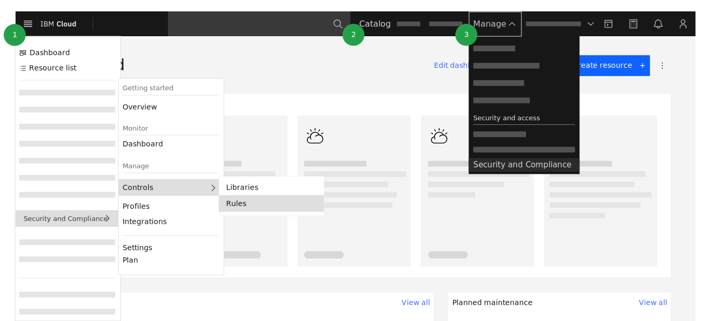

---

copyright:
  years: 2020, 2022
lastupdated: "2022-12-14"

keywords: getting started with the security and compliance center, get started, security, compliance

subcollection: security-compliance

content-type: tutorial
services: security-compliance, cos
completion-time: 5m

---

{:codeblock: .codeblock}
{:screen: .screen}
{:download: .download}
{:external: target="_blank" .external}
{:faq: data-hd-content-type='faq'}
{:gif: data-image-type='gif'}
{:important: .important}
{:note: .note}
{:pre: .pre}
{:tip: .tip}
{:preview: .preview}
{:deprecated: .deprecated}
{:beta: .beta}
{:term: .term}
{:shortdesc: .shortdesc}
{:script: data-hd-video='script'}
{:support: data-reuse='support'}
{:table: .aria-labeledby="caption"}
{:troubleshoot: data-hd-content-type='troubleshoot'}
{:help: data-hd-content-type='help'}
{:tsCauses: .tsCauses}
{:tsResolve: .tsResolve}
{:tsSymptoms: .tsSymptoms}
{:java: .ph data-hd-programlang='java'}
{:javascript: .ph data-hd-programlang='javascript'}
{:swift: .ph data-hd-programlang='swift'}
{:curl: .ph data-hd-programlang='curl'}
{:video: .video}
{:step: data-tutorial-type='step'}
{:tutorial: data-hd-content-type='tutorial'}
{:ui: .ph data-hd-interface='ui'}
{:cli: .ph data-hd-interface='cli'}
{:api: .ph data-hd-interface='api'}
{:release-note: data-hd-content-type='release-note'}

# Getting started with {{site.data.keyword.compliance_short}}
{: #getting-started}
{: toc-content-type="tutorial"}
{: toc-services="security-compliance, cos"}
{: toc-completion-time="5m"}

For highly regulated industries, such as financial services, achieving continuous compliance within a cloud environment is an important first step toward protecting customer and application data. Historically, that process was difficult and manual, which placed your organization at risk. But, with {{site.data.keyword.compliance_full}}, you can integrate daily, automatic compliance checks into your development lifecycle to help minimize that risk.
{: shortdesc}

Trying to evaluate an environment other than {{site.data.keyword.cloud_notm}}? Get started with [collector-based evaluations](/docs/security-compliance?topic=security-compliance-collector). 
{: note}

## Before you begin
{: #before-gs}

Before you get started, be sure that you have the required level of access to create an attachment and view results. To create an attachment, you need the **Editor** platform role or higher. If you're working with an Enterprise account, you must also have the **Enterprise** service role. For more information, see [Assigning access](/docs/security-compliance?topic=security-compliance-access-management). 

Running an evaluation does not ensure regulatory compliance. An evaluation provides a point in time statement of your current posture for a specific resource. It is your responsibility to review and interpret the results to ensure that your organization is adhering to the controls that are required for your industry. 
{: important}

## Navigate to the {{site.data.keyword.compliance_short}} UI
{: #gs-access}
{: step}

Because {{site.data.keyword.compliance_short}} is built into the platform and available by default, you can access the UI in several different ways.

{: caption="Figure 1. How to access {{site.data.keyword.compliance_short}}" caption-side="bottom"}

After you sign in to {{site.data.keyword.cloud_notm}}, you can access {{site.data.keyword.compliance_short}} in one of three ways:

* By clicking the **Menu** icon  **> Security and Compliance** in the navigation.
* By searching for **Security and Compliance Center** in the {{site.data.keyword.cloud_notm}} catalog.
* By selecting **Security and Compliance** from the **Manage** drop-down.

## Configure storage
{: #gs-storage}
{: step}

Before you can start evaluating your resources for compliance, you must configure a Cloud Object Storage bucket where the service can forward your results data for long-term storage. For more information about bucket requirements, see [Storing and processing data in {{site.data.keyword.compliance_short}}](/docs/security-compliance?topic=security-compliance-storage).

To connect your Cloud Object Storage bucket, you can use the {{site.data.keyword.compliance_short}} UI.

1. In the navigation, click **Settings**.
2. On the **Storage** tile, click **Connect**.
3. Ensure that your service-to-service policy between Cloud Object Storage and {{site.data.keyword.compliance_short}} is configured. If your policy is already in place, this screen is not shown, and you can skip to the next step. 
4. Select an instance of Cloud Object Storage.
5. From the table, select the bucket that you want to use.
6. Click **Connect**.

## Create an attachment
{: #gs-attachment}
{: step}

An attachment is how you target a specific grouping of your resources to evaluate against a specific profile.

1. In the navigation, click **Security and Compliance** or **Current Posture**.
2. Click **Get started**.
3. Select the **Profile** that you want to use to evaluate compliance.
4. Target the specific resources to scan by selecting a **Scope**. Then, select the resources that you want to exclude from your scope.
5. Click **Next**.
6. Provide the specific values that you want to use when the parameters are evaluated. 

   The values that you provide are evaluated only for this attachment. Changing the values in this flow does not override the default value that is set in the control library.
   
7. Click **Next**.
8. Review your choices and click **Create**.

When you create your attachment, a scan is scheduled. When the scan completes your results are available on the **Dashboard** in the {{site.data.keyword.compliance_short}} UI.

## Next steps
{: #gs-next}

While you wait for your scan to complete, learn more about [the way the service works](/docs/security-compliance?topic=security-compliance-posture-management) or try [creating your own rule](/docs/security-compliance?topic=security-compliance-rules-define).

