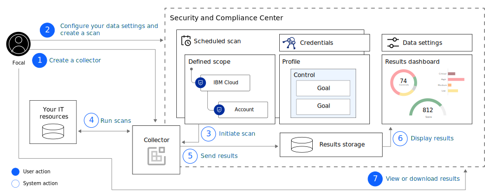

---

copyright:
  years: 2021
lastupdated: "2021-08-26"

keywords: best practices security and compliance, secure development, security strategy, insights, governance

subcollection: security-compliance

---

{:codeblock: .codeblock}
{:screen: .screen}
{:download: .download}
{:external: target="_blank" .external}
{:faq: data-hd-content-type='faq'}
{:gif: data-image-type='gif'}
{:important: .important}
{:note: .note}
{:pre: .pre}
{:tip: .tip}
{:preview: .preview}
{:deprecated: .deprecated}
{:beta: .beta}
{:term: .term}
{:shortdesc: .shortdesc}
{:script: data-hd-video='script'}
{:support: data-reuse='support'}
{:table: .aria-labeledby="caption"}
{:troubleshoot: data-hd-content-type='troubleshoot'}
{:help: data-hd-content-type='help'}
{:tsCauses: .tsCauses}
{:tsResolve: .tsResolve}
{:tsSymptoms: .tsSymptoms}
{:java: .ph data-hd-programlang='java'}
{:javascript: .ph data-hd-programlang='javascript'}
{:swift: .ph data-hd-programlang='swift'}
{:curl: .ph data-hd-programlang='curl'}
{:video: .video}
{:step: data-tutorial-type='step'}
{:tutorial: data-hd-content-type='tutorial'}
{:ui: .ph data-hd-interface='ui'}
{:cli: .ph data-hd-interface='cli'}
{:api: .ph data-hd-interface='api'}

# What is Posture Management?
{: #posture-management}

For highly regulated industries, such as financial services, achieving continuous security within a cloud environment is an important first step toward protecting customer and application data. Historically, that process has been difficult and manual, which placed your organization at risk. But, with {{site.data.keyword.cloud_notm}} you can integrate automatic security checks into every day workflows that are designed to minimize risk.
{: shortdesc}

Security and compliance are two concepts that are often spoken of interchangeably. But, there are some significant differences between them. For example, compliance regulations change slowly and are generally measured as a snapshot in time. Whereas security threats are constant and always changing. Depending on the role that you fill in your organization, you might focus on ensuring compliance to industry regulations or you might focus more on mitigating incoming security threats.

Most often, as a compliance focal, you need to adhere to multiple regulations or laws at once. You are responsible for understanding and implementing the controls that are required for your business. You also have a responsibility to gather evidence that proves to external auditors that your compliance checks are in place and in continuous compliance. To get started, you can [configure a managed collector](/docs/security-compliance?topic=security-compliance-ibm-collector) or [manually create and install one](/docs/security-compliance?topic=security-compliance-collector-manual) to assess your available resources and their configuration.

## How it works
{: #how-it-works}

When you work with the {{site.data.keyword.compliance_short}}, you interact with several interrelated components, including profiles, config rules, and scopes. Check out the following diagram to see how the components work together to help you manage and validate compliance in {{site.data.keyword.cloud_notm}}.

{: caption="Figure 1. How the Posture Management components work together" caption-side="bottom"}

As a security or compliance focal, you create credentials and install a collector to get started. Then, you create profiles and scopes to start validating specific sections of your business by using specific regulations or requirements. With everything configured, the {{site.data.keyword.compliance_short}} works in the background to monitor for potential risk by scanning your resources on a schedule that you determined. When the scans of your resources are complete, the service does a quick calculation to determine your security and compliance score before displaying the score and your detailed results in a dashboard. From the dashboard, you can download a detailed report that you can use to provide evidence to stakeholders or external auditors.

&ast;*Posture Management is available for {{site.data.keyword.cloud_notm}}, Amazon Web Services, Microsoft Azure, Google Cloud Platform, and on-premises environments.*
